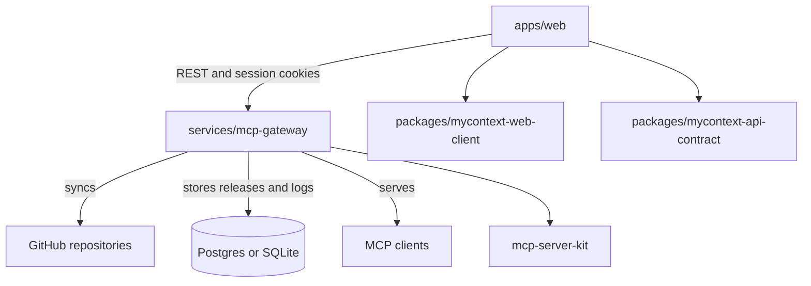

# Architecture Overview

MyContextProtocol is split into a Bun/Turbo application monorepo plus one external Swift package:

- `apps/web` is the Next.js dashboard deployed by Vercel.
- `services/mcp-gateway` is the Swift/Vapor API and MCP gateway deployed by Fly.io.
- `packages/mycontext-web-client` owns shared TypeScript API-facing types.
- `packages/mycontext-api-contract` owns the human-readable backend API contract.
- `mcp-server-kit` is the sibling SwiftPM package for reusable MCP protocol primitives.

The product-specific database catalog, auth, billing, tenant routing, and request logging remain in `services/mcp-gateway`. Protocol-level JSON-RPC and MCP data shapes belong in `mcp-server-kit` so future Swift services can share them without depending on Vapor or Fluent.
